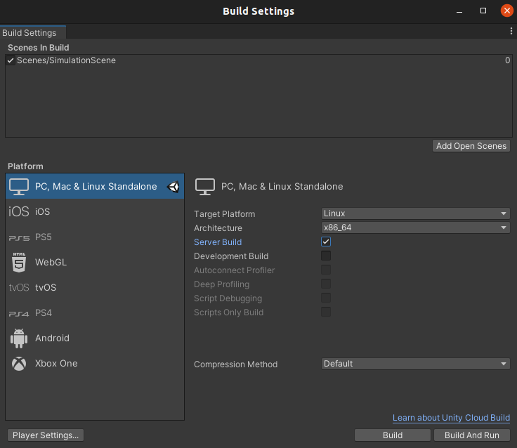

# Multi-Agent-Exploration-Simulator - Maes
MAES is a tool for simulating and testing exploration algorithms in a realistic continuous space environment.
Maes is visualised and physics driven using the Unity Game Engine. 
Maes was created as part of a Master's Thesis at Aalborg University, Denmark, on the subject of distributed systems. 

A video trailer for Maes can be found [here](https://youtu.be/lgUNrTfJW5g)

# Getting started
Maes requires an installed Unity editor (It is last tested with version 2020.3.18f1).
It has been tested to work on both Linux (Ubuntu 21.04), MacOS Monterey 12 and Windows 10.

Maes is already preconfigured to run with a simulation example, so it should run directly through Unity.

## Changing Simulation Setup and Scenarios
A scenario is a configuration, that can be injected into a simulation, that the simulator can then execute.
Several different sets of scenarios can be generated by the preconfigured methods inside the [ScenarioGenerator.cs](Assets/Scripts/ScenarioGenerator.cs) file.
The scenarios are then generated and queued inside the `Start()` method of the [Simulator.cs](Assets/Scripts/Simulator.cs) for later injection into a simulation.
The simulator automatically dequeues the next simulation, when the current is finished.

A scenario contains a **random seed**, a **SimulationEndCriteriaDelegate**, a **map spawner delegate**, a **robot spawner delegate** and **robot constraints**.
Additionally, a scenario contains a file name, that is used if the statistics of the given run are set to be exported. 
This can be configured inside the [GlobalSettings.cs](Assets/Scripts/GlobalSettings.cs) file.

If you create your own custom scenarios by creating a new method inside [ScenarioGenerator.cs](Assets/Scripts/ScenarioGenerator.cs), remember to call it in the [Simulator.cs](Assets/Scripts/Simulator.cs) **Start()** method.

### Simulator Parameters Explanations
Map Configuration:

| Name                                    | Type                 | Meaning                                                                                                                                                                 |
|-----------------------------------------|----------------------|-------------------------------------------------------------------------------------------------------------------------------------------------------------------------|
| Width                                   | Int                  | Width in tiles                                                                                                                                                          |
| Height                                  | Int                  | Height in tiles                                                                                                                                                         |
| Random Seed                             | Int                  | Affects the map generation                                                                                                                                              |
| Border size                             | Int                  | Makes tiles up to n tiles from the border solid, i.e. not traversable                                                                                                   |
| Scaling                                 | Float                | Scales the map, which affects the robots size relative to the map. NOTE: Sometimes has bugs                                                                             |
| Random Fill Percent (cave map)          | Float in ]0.0-100.0] | Determines the amount of the map that is filled with solid tiles                                                                                                        |
| Smoothing Runs (cave map)               | Int                  | Smoothens the map like conways game of life. i.e tiles with many solid neighbors turn solid                                                                             |
| Connection Passages Width (cave map)    | Int                  | Some rooms may not be interconnected after the smoothing runs. In this step corridors are made between the rooms. This parameter determines the width of the corridors. |
| Wall Threshold Size (cave map)          | Int                  | All groups of wall tiles smaller than this will be made open (traversable)                                                                                              |
| Room Threshold Size (cave map)          | Int                  | All groups of open tiles smaller than this will be made solid (non-traversable)                                                                                         |
| Max Hall Percent (building map)         | Float in ]0.0-100.0] | Hall are generated until no longer possible (Minimum room side length disallows further splitting) or until this percentage is reached                                  |
| Hall Width (building map)               | Int                  | The width of the generated halls in tiles                                                                                                                               |
| Minimum Room Side Length (building map) | Int                  | No room can have a side shorter than this value. A high value results in bigger rooms                                                                                   |
| Door Width (building map)               | Int                  | The width of the doors connecting two rooms                                                                                                                             |
| Door Padding (building map)             | Int                  | Minimum distance from a door to a wall intersection. A higher value puts the more in the middle of wall sections.                                                       |

Agent Constraints:

| Name                                  | Type  | Meaning                                                                                                                             |
|---------------------------------------|-------|-------------------------------------------------------------------------------------------------------------------------------------|
| Broadcast Range                       | Float | The range at which agents can communicate measured in tiles                                                                         |
| Broadcast Blocked by Walls            | Bool  | If true, agent communication requires line of sight                                                                                 |
| Sense Nearby Agents Range             | Float | The range at which agents knows of other agents' presence, i.e. distance and angle to the other agent measured in tiles             |
| Sense Nearby Agents Blocked by Walls  | Bool  | If true, agents only know of other agents' presence, if they are within line of sight                                               |
| Automatically Update SLAM             | Bool  | Disables SLAM, which disables position approximation                                                                                |
| SLAM Update Interval in Ticks         | Int   | SLAM map and position is updated at this rate (10 ticks = 1 second)                                                                 |
| SLAM Synchronize Interval in Ticks    | Int   | If agents are within broadcast range (also includes blocked by walls) they will synchronize maps at this rate (10 ticks = 1 second) |
| SLAM Positioning Inaccuracy           | Float | An agent's actual position may differ by up to this value in both the x and y axis                                                  |
| Distribute SLAM                       | Bool  | If true, agents will attempt to distribute their slam at every slam synchronize interval                                            |
| Environment Tag Read Range            | Float | Determines as which range measured in tiles an agent can read a tag                                                                 |
| Lidar Range                           | Float | Used for ray tracing the vision of an agent. Everything within line of sight and this distance will be marked as explored           |

Agent Spawn Configuration:

| Name                  | Type                                                                                             | Meaning                                                                                                                                                                                                                |
|-----------------------|--------------------------------------------------------------------------------------------------|------------------------------------------------------------------------------------------------------------------------------------------------------------------------------------------------------------------------|
| Spawn Configuration   | Delegate with type: List\<MonaRobot> RobotFactory(SimulationMap<bool> map, RobotSpawner spawner) | A function for spawning the agents in a specific way. Presets are available, such as "togetherAroundPoint" and "spawnInBiggestRoom". Additionally, "inHallways" is a building map type specific spawning configuration |
| Number of Agents      | Int                                                                                              | The number of agents spawned into the map                                                                                                                                                                              |
| Random Seed           | Int                                                                                              | Used to provide agents with individual random seeds                                                                                                                                                                    |
| Agent Relative Size   | Float in ]0, 1.0]                                                                                | The size of an agent relative to a tile. i.e. if this value is 1 an agent's diameter is equal to the length of a tile.                                                                                                 |
| Exploration Algorithm | Delegate with type: IExplorationAlgorithm CreateAlgorithmDelegate(int randomSeed)                | A function that returns an instance of the exploration algorithm with its dependencies injected (e.g. random seed or other algorithm specific parameters)                                                              |

## Creating your own algorithm
In order to implement your own algorithm, you must create a class that implements the [IExplorationAlgorithm.cs](Assets/Scripts/ExplorationAlgorithm/IExplorationAlgorithm.cs) interface.
This provides the algorithm with access to the robot controller, which in turn provides access to movement controls, slam map and all sensor data available on the agent given the constraints of the scenario.

In order to test you algorithm, make sure you configure the simulator to use a scenario that uses the algorithm.
Instructions for this can be found in [Changing Simulation Setup](#changing-simulation-setup-and-scenarios).

## Extracting Statistics
Maes supports extraction of data as csv files regarding both coverage and exploration.
Configuring statistics gathering is done in the [GlobalSettings.cs](Assets/Scripts/GlobalSettings.cs). 
Here the path for the statistics files can be changed, statistics gathering can be enabled/disabled and the interval for saving the data of a given simulation can be changed.
The csv files are created whenever a simulation finishes, if it is enabled.

The default path for the csv files is on the desktop inside a /MaesStatistics/ folder, that is created in the process.

The csv files can be used directly or processed and turned into tables using [this python script](Assets/Scripts/Statistics/DataProcessingScript.py).

## Headless Runs
Maes supports headless runs by utilizing Unity's own [batch mode](https://docs.unity3d.com/Manual/PlayerCommandLineArguments.html).
These runs cannot be executed through the Unity Editor, and must be run as compiled builds.

A headless run is invoked by adding the command line argument `-batchmode` when executing the compiled build.
- If the "**Server Build**" build setting is checked, the resulting build will output CLI-like information when executing.
- If the "**Server Build**" build setting is left unchecked, a black window will render on the screen while the headless run is executing.

Headless runs will start simulating immediately on the "**Fast as possible**" speed setting ().

# Contributors

Philip Irming Holler - [philipholler94@gmail.com](mailto:philipholler94@gmail.com)

Magnus Kirkegaard Jensen - [magnjensen@gmail.com](mailto:magnjensen@gmail.com)

Malte Zoëga Andreasen - [malte@mza.dk](mailto:malte@mza.dk)
