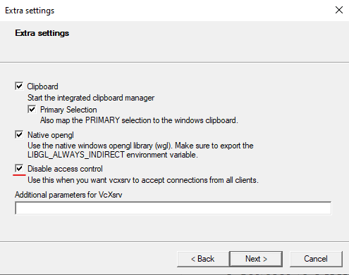

# Introduction to MAES
MAES is a tool for simulating and testing multi robot online exploration algorithms in a realistic continuous space environment.
MAES is visualised and physics driven using the Unity Game Engine.
MAES was created as part of a Master's Thesis at Aalborg University, Denmark, on the subject of distributed systems.

A video trailer for MAES can be found [here](https://youtu.be/lgUNrTfJW5g)

<p float="left">
  
  
</p>

# Table of Contents
- [Introduction to MAES](#introduction-to-maes)
- [Getting started](#getting-started)
    * [Running in UnityMode](#running-in-unitymode)
        + [Creating your own algorithm](#creating-your-own-algorithm)
    * [Running in ROSMode](#running-in-rosmode)
        + [ROSMode with Docker](#rosmode-with-docker)
            - [RVIZ visualisation in Windows 10](#rviz-visualisation-in-windows-10)
        + [ROSMode running natively (Without Docker)](#rosmode-running-natively-without-docker)
- [ROS Workspace packages](#ros-workspace-packages)
- [Extracting Statistics (Applies to both ROSMode and UnityMode)](#extracting-statistics-applies-to-both-rosmode-and-unitymode)
- [Headless Runs (Only UnityMode)](#headless-runs-only-unitymode)
- [Simulator Parameters Explanations](#simulator-parameters-explanations)
- [Contributors](#contributors)

# Getting started
MAES can be run in two different configurations, either ROSMode or UnityMode. 
UnityMode requires a unity editor installed and allows for developing algorithm in C#.
UnityMode requires an installed Unity editor (It is last tested with version 2021.2.17f1).
It has been tested to work on both Linux (Ubuntu 20.04, 21.04, 21.10 and 22.04), MacOS Monterey 12 and Windows 10.
Click [here](#running-in-unitymode) to get started in UnityMode.

ROSMode enables ROS2 Galactic integration, where the robots can be controlled from ROS (Robot Operating System) nodes.
In ROSMode development is done in either Python or C++. 
A Docker image with ROS preinstalled is supplied to make it easier to get started.
Click [here](#running-in-rosmode) to get started running in ROSMode.

## Running in UnityMode
A scenario is a configuration, that can be injected into a simulation, that the simulator can then execute.
Several different sets of scenarios can be generated by the preconfigured methods inside the [ScenarioGenerator.cs](Assets/Scripts/ScenarioGenerator.cs) file.
The scenarios are then generated and queued inside the `Start()` method of the [Simulator.cs](Assets/Scripts/Simulator.cs) for later injection into a simulation.
The simulator automatically dequeues the next simulation, when the current is finished.

A scenario contains a **random seed**, a **SimulationEndCriteriaDelegate**, a **map spawner delegate**, a **robot spawner delegate** and **robot constraints**.
Additionally, a scenario contains a file name, that is used if the statistics of the given run are set to be exported. 
This can be configured inside the [GlobalSettings.cs](Assets/Scripts/GlobalSettings.cs) file.

If you create your own custom scenarios by creating a new method inside [ScenarioGenerator.cs](Assets/Scripts/ScenarioGenerator.cs), remember to call it in the [Simulator.cs](Assets/Scripts/Simulator.cs) **Start()** method.

### Creating your own algorithm
In order to implement your own algorithm, you must create a class that implements the [IExplorationAlgorithm.cs](Assets/Scripts/ExplorationAlgorithm/IExplorationAlgorithm.cs) interface.
This provides the algorithm with access to the robot controller, which in turn provides access to movement controls, slam map and all sensor data available on the agent given the constraints of the scenario.

In order to test you algorithm, make sure you configure the simulator to use a scenario that uses the algorithm as mentioned in [this](#running-in-unitymode) Section.

## Running in ROSMode
MAES can be run with ROS running either in a docker image or natively. The docker image has everything preinstalled and is thus easier to set up. 
 
### ROSMode with Docker
1. Install Docker https://docs.docker.com/get-docker/ (On Windows 10 we recommend using the WSL2 backend for Docker)
2. Download MAES package (TODO)
3. Open terminal in root of MAES Package
4. Build image from package with the following command
```bash
docker build --force-rm -t ros4maes -f Docker/Dockerfile .
```
5. Spinup container either with RVIZ visualisation or not.

5.1a Without RVIZ (Works on Windows, macOS and Linux)
```bash
docker run --rm -it \
-p 10000:10000 \
-p 10022:22 \
-v $(pwd)/maes-ros-slam-ws:/home/maes-user/code \
--name ros4maes \
ros4maes
```
5.1b With RVIZ (Only tested on Ubuntu 20.04, 21.04, 21.10 and 22.04. Possible workaround for Windows 10 [here](#rviz-visualisation-in-windows-10))
```bash
xhost +local:docker
```
```bash
docker run --rm -it \
  -p 10000:10000 \
  -p 10022:22 \
  -v $(pwd)/maes-ros-slam-ws:/home/maes-user/code \
  -v /tmp/.X11-unix:/tmp/.X11-unix \
  --env=DISPLAY \
  --name ros4maes \
  ros4maes
```
6. Launch multiple robots with following command

6.1a Without RVIZ
```bash
ros2 launch maes_ros2_interface maes_ros2_multi_robot_launch.py use_rviz:=false
```

6.1b With RVIZ
```bash
ros2 launch maes_ros2_interface maes_ros2_multi_robot_launch.py
```


7. Open Maes executable from package (TODO)

HOW TO CONFIGURE:

The workspace (maes-ros-slam-ws) inside the MAES package is shared with the docker container. 
It is thus possible to change these files directly using your favorite editor or IDE.

The logic controlling the behavior of the robots can be found in [maes_robot_controller.py](maes-ros-slam-ws/src/maes_robot_controller/maes_robot_controller/maes_robot_controller.py). 
Actionservers, subscriptions and services are already setup and can be used inside the logic_loop function to control the robot. 
The logic_loop is called as a callback function whenever a logic tick occurs in MAES.

The configuration of the ROS2 system can be changed by tuning parameters in [maes_config.yaml](maes-ros-slam-ws/src/maes_ros2_interface/maes_config.yaml) found inside the maes_ros2_interface package in the workspace.
Note: The field names must be written in [snake_case](https://en.wikipedia.org/wiki/Snake_case).
Explanations for all configuration parameters can be seen in Section [Simulation Parameters Explanations](#simulator-parameters-explanations).
Both MAES and ROS take parameters from the same file, so they automatically synchronise.

Remember to colcon build after each change in config file or controller.

#### RVIZ visualisation in Windows 10
If you are on Windows 10, you will have to install [VcXsrv](https://sourceforge.net/projects/vcxsrv/), an X-server for Windows.
After installation, open the XLaunch program from the start menu:


Going through the configuration, choose the default values for the first two windows and add a checkmark to the third window in the "Disable access control" box:



<sup><sup>(Be aware: this is an unsafe setting to leave on for a prolonged time. Therefore, do not have this setting enabled unless you are about to launch the ROS-container)</sup></sup>

Finally, you can choose to save this configuration to local storage, and use it as a shortcut for starting up XLaunch.
To launch an X-server with the settings now, press "finish".

Now, in your WSL terminal, go to the root MAES directory and enter the following commands:
```bash
export DISPLAY=$(grep nameserver /etc/resolv.conf | awk '{print $2}'):0.0
```
```bash
docker run --rm -it \
  -p 10000:10000 \
  -p 10022:22 \
  -v $(pwd)/maes-ros-slam-ws:/home/maes-user/code \
  -e DISPLAY \
  --name ros4maes \
  ros4maes
```


Once the container is up and running, you can test to see if a GUI will render by executing a program with a GUI. `rviz2` for instance.
If the configuration has worked correctly, a program window should appear.

**Other OS?**

On other operating systems it will be necessary to research how to allow a docker container to render GUI on its host system.

### ROSMode running natively (Without Docker)
This has only been tested on Ubuntu 20.04

1. Install ROS2 galactic desktop (https://docs.ros.org/en/galactic/Installation/Ubuntu-Install-Debians.html)
2. Install Nav2 for galactic (https://navigation.ros.org/build_instructions/index.html)
3. Install slam_toolbox for galactic (https://navigation.ros.org/tutorials/docs/navigation2_with_slam.html)
4. Source installation with command (Must be done in every bash instance. To do it permanently, consider adding command to .profile file in the home directory)
```bash
source /opt/ros/galactic/setup.bash
```
5. Download maes_ros_slam_ws workspace from this repo
6. Build workspace (Must be run from root of workspace directory)
```bash
colcon build
```
7. Source install (Must be run from root of workspace directory)
```bash
source install/setup.sh
```
9. Launch multiple robots with launch file maes_ros2_multi_robot_launch.py inside pkg maes_ros2_interface 
```bash
ros2 launch maes_ros2_interface maes_ros2_multi_robot_launch.py
```
10. Open Maes executable from package (TODO)

The logic controlling the behavior of the robots can be found in [maes_robot_controller.py](maes-ros-slam-ws/src/maes_robot_controller/maes_robot_controller/maes_robot_controller.py).
Actionservers, subscriptions and services are already setup and can be used inside the logic_loop function to control the robot.
The logic_loop is called as a callback function whenever a logic tick occurs in MAES.

The configuration of the ROS2 system can be changed by tuning parameters in [maes_config.yaml](maes-ros-slam-ws/src/maes_ros2_interface/maes_config.yaml).
found inside the maes_ros2_interface package in the workspace. Many fields have default values, which can be seen in [MaesYamlConfigLoader.cs](Assets/Scripts/MaesYamlConfigLoader.cs).
Note: The field names must be written in [snake_case](https://en.wikipedia.org/wiki/Snake_case).
Explanations for all configuration parameters can be seen in Section [Simulation Parameters Explanations](#simulator-parameters-explanations).
Both MAES and ROS take parameters from the same file, so they automatically synchronise.

Remember to colcon build after each change in config file or controller.

# ROS Workspace packages
A workspace is included in this repository for connecting ROS with MAES. 
The workspace is found under [maes-ros-slam-ws](maes-ros-slam-ws) and contains 5 packages.

| Name                  | Content                                                                                                                                                                                                                                                                                                                                                                                                                                 |
|-----------------------|-----------------------------------------------------------------------------------------------------------------------------------------------------------------------------------------------------------------------------------------------------------------------------------------------------------------------------------------------------------------------------------------------------------------------------------------|
| maes_msgs             | Contains ROS msgs types used to communicate robot state between MAES and ROS                                                                                                                                                                                                                                                                                                                                                            |
| maes_robot_controller | Contains the maes_robot_controller.py script, which has the main logic loop for controlling the robots in MAES. Subscriptions, services and actions servers for nav2, state etc. are already setup in this script. Each robot has its own controller.                                                                                                                                                                                   |
| maes_ros2_interface   | Contains behaviour trees, main launch files, parameters files, rviz configuration and main parameter file shared between ROS and MAES, i.e. [maes_config.yaml](maes-ros-slam-ws/src/maes_ros2_interface/maes_config.yaml). In order to launch a multi robot system, the [maes_ros2_multi_robot_launch.py](maes-ros-slam-ws/src/maes_ros2_interface/launch/maes_ros2_multi_robot_launch.py) file is used.                                |
| ROS-TCP-Endpoint      | A node relaying all messages from the ROS-TCP-Connector, which receives the ROS msgs sent inside MAES. The official repository can be found here: [https://github.com/Unity-Technologies/ROS-TCP-Endpoint](https://github.com/Unity-Technologies/ROS-TCP-Endpoint ). We use version 0.7.0. The TCP connector inside MAES is also version 0.7.0.                                                                                         |
| slam_toolbox          | Officially available at [https://github.com/SteveMacenski/slam_toolbox/](https://github.com/SteveMacenski/slam_toolbox/tree/galactic). We included it here, since the official release of 2.5.1 from September 2021 had a bug, where the odom was constantly published to /tf. The version in our repository is from the galactic branch and the latest commit has message "Backport 479 galactic" and was committed on 25. march 2022. |

 

# Extracting Statistics (Applies to both ROSMode and UnityMode)
Maes supports extraction of data as csv files regarding both coverage, exploration and communication.
Configuring statistics gathering is done in the [GlobalSettings.cs](Assets/Scripts/GlobalSettings.cs) for UnityMode and in the [maes_config.yaml](maes-ros-slam-ws/src/maes_ros2_interface/maes_config.yaml) for ROSMode. 
Here the path for the statistics files can be changed, statistics gathering can be enabled/disabled and the interval for saving the data of a given simulation can be changed.
The csv files are created whenever a simulation finishes, if it is enabled. A simulation finishes when the end criteria from the configuration is reached.

The default path for the csv files is on the desktop inside a /MaesStatistics/ folder, that is created in the process.

The csv files can be used directly or processed and turned into tables using [this python script](Assets/Scripts/Statistics/DataProcessingScript.py).

# Headless Runs (Only UnityMode)
Maes supports headless runs by utilizing Unity's own [batch mode](https://docs.unity3d.com/Manual/PlayerCommandLineArguments.html).
These runs cannot be executed through the Unity Editor, and must be run as compiled builds.

A headless run is invoked by adding the command line argument `-batchmode` when executing the compiled build.
- If the "**Server Build**" build setting is checked, the resulting build will output CLI-like information when executing.
- If the "**Server Build**" build setting is left unchecked, a black window will render on the screen while the headless run is executing.


Headless runs will start simulating immediately on the "**Fast as possible**" speed setting (), until the scenario queue is empty.

When in batch mode, the application will quit automatically when the scenario queue is empty.

# Simulator Parameters Explanations
Map Configuration:

| Name                                    | Type                 | Meaning                                                                                                                                                                 |
|-----------------------------------------|----------------------|-------------------------------------------------------------------------------------------------------------------------------------------------------------------------|
| Width                                   | Int                  | Width in tiles                                                                                                                                                          |
| Height                                  | Int                  | Height in tiles                                                                                                                                                         |
| Random Seed                             | Int                  | Affects the map generation                                                                                                                                              |
| Border size                             | Int                  | Makes tiles up to n tiles from the border solid, i.e. not traversable                                                                                                   |
| Scaling                                 | Float                | Scales the map, which affects the robots size relative to the map. NOTE: Sometimes has bugs                                                                             |
| Random Fill Percent (cave map)          | Float in ]0.0-100.0] | Determines the amount of the map that is filled with solid tiles                                                                                                        |
| Smoothing Runs (cave map)               | Int                  | Smoothens the map like conways game of life. i.e tiles with many solid neighbors turn solid                                                                             |
| Connection Passages Width (cave map)    | Int                  | Some rooms may not be interconnected after the smoothing runs. In this step corridors are made between the rooms. This parameter determines the width of the corridors. |
| Wall Threshold Size (cave map)          | Int                  | All groups of wall tiles smaller than this will be made open (traversable)                                                                                              |
| Room Threshold Size (cave map)          | Int                  | All groups of open tiles smaller than this will be made solid (non-traversable)                                                                                         |
| Max Hall Percent (building map)         | Float in ]0.0-100.0] | Hall are generated until no longer possible (Minimum room side length disallows further splitting) or until this percentage is reached                                  |
| Hall Width (building map)               | Int                  | The width of the generated halls in tiles                                                                                                                               |
| Minimum Room Side Length (building map) | Int                  | No room can have a side shorter than this value. A high value results in bigger rooms                                                                                   |
| Door Width (building map)               | Int                  | The width of the doors connecting two rooms                                                                                                                             |
| Door Padding (building map)             | Int                  | Minimum distance from a door to a wall intersection. A higher value puts the more in the middle of wall sections.                                                       |

Agent Constraints:

| Name                                   | Type     | Meaning                                                                                                                                                                                                                                                                                                                                    |
|----------------------------------------|----------|--------------------------------------------------------------------------------------------------------------------------------------------------------------------------------------------------------------------------------------------------------------------------------------------------------------------------------------------|
| Automatically Update SLAM              | Bool     | Disables SLAM, which disables position approximation                                                                                                                                                                                                                                                                                       |
| SLAM Update Interval in Ticks          | Int      | SLAM map and position is updated at this rate (10 ticks = 1 second)                                                                                                                                                                                                                                                                        |
| SLAM Synchronize Interval in Ticks     | Int      | If agents are within broadcast range (also includes blocked by walls) they will synchronize maps at this rate (10 ticks = 1 second)                                                                                                                                                                                                        |
| SLAM Positioning Inaccuracy            | Float    | An agent's actual position may differ by up to this value in both the x and y axis                                                                                                                                                                                                                                                         |
| Distribute SLAM                        | Bool     | If true, agents will attempt to distribute their slam at every slam synchronize interval                                                                                                                                                                                                                                                   |
| Slam Ray Trace Count                   | Int      | Optional value for setting amount of ray traces for each agent. If not set, it will automatically be calculated depending on the range of the SlamRayTraces.                                                                                                                                                                               |
| Slam Ray Trace Range                   | Float    | Used for ray tracing the vision of an agent. Everything within line of sight and this distance will be marked as explored                                                                                                                                                                                                                  |
| Environment Tag Read Range             | Float    | Determines as which range measured in tiles an agent can read a tag                                                                                                                                                                                                                                                                        |
| Relative Move Speed                    | Float    | Speed relative to tiles. A bigger map with bigger doors would f.x. make the agent move relatively slower, if this parameter remained the same. 1.0f is default. 10f would make the force placed on the robot 10x larger                                                                                                                    |
| Robot Relative Size                    | Float    | A value in ]0, 1.0] that determines the size of the agent relative to a single tile in the environment                                                                                                                                                                                                                                     |
| Sense Nearby Agents Range              | Float    | The range at which agents knows of other agents' presence, i.e. distance and angle to the other agent measured in tiles                                                                                                                                                                                                                    |
| Sense Nearby Agents Blocked by Walls   | Bool     | If true, agents only know of other agents' presence, if they are within line of sight                                                                                                                                                                                                                                                      |
| MinimumSignalTransmissionProbability   | Float    | The smallest probability value that still allows communication between robots                                                                                                                                                                                                                                                              |
| CalculateSignalTransmissionProbability | Delegate | A function that provides a value representing the probability of transmitting a message. If this value is above the MinimumSignalTransmissionProbability then the message will be transmitted, otherwise it will be discarded. This function is given the total distance travelled by the signal and the distance travelled through walls. |

In the YAML file you cannot supply a function for the message transmission probability. Instead you can supply a maximum broadcast range and a parameters that indicates whether message can pass through walls:

** YAML ONLY **

| Name                                 | Type  | Meaning                                                                                                                                                                                                                   |
|--------------------------------------|-------|---------------------------------------------------------------------------------------------------------------------------------------------------------------------------------------------------------------------------|
| Broadcast Range                      | Float | The range at which agents can communicate measured in tiles                                                                                                                                                               |
| Broadcast Blocked by Walls           | Bool  | If true, agent communication requires line of sight                                                                                                                                                                       |


Agent Spawn Configuration:

| Name                  | Type                                                                                             | Meaning                                                                                                                                                                                                                |
|-----------------------|--------------------------------------------------------------------------------------------------|------------------------------------------------------------------------------------------------------------------------------------------------------------------------------------------------------------------------|
| Spawn Configuration   | Delegate with type: List\<MonaRobot> RobotFactory(SimulationMap<bool> map, RobotSpawner spawner) | A function for spawning the agents in a specific way. Presets are available, such as "togetherAroundPoint" and "spawnInBiggestRoom". Additionally, "inHallways" is a building map type specific spawning configuration |
| Number of Agents      | Int                                                                                              | The number of agents spawned into the map                                                                                                                                                                              |
| Random Seed           | Int                                                                                              | Used to provide agents with individual random seeds                                                                                                                                                                    |
| Exploration Algorithm | Delegate with type: IExplorationAlgorithm CreateAlgorithmDelegate(int randomSeed)                | A function that returns an instance of the exploration algorithm with its dependencies injected (e.g. random seed or other algorithm specific parameters)                                                              |

Global settings

MAES contains several settings that influences the behaviour of the simulation. These can be found in the [GlobalSettings.cs](Assets/Scripts/GlobalSettings.cs) file. An explanation can be found below

| Name                                         | Type   | Description                                                                                                                                                                                                                                                                                                                                                                                                                                                         |
|:---------------------------------------------|:-------|:--------------------------------------------------------------------------------------------------------------------------------------------------------------------------------------------------------------------------------------------------------------------------------------------------------------------------------------------------------------------------------------------------------------------------------------------------------------------|
| Logic Tick Delta Millis                      | Int    | The amount of simulated milliseconds between each logic tick, i.e. running of code from an exploration algorithm                                                                                                                                                                                                                                                                                                                                                    |
| Physics Ticks Per Logic Update               | Int    | The amount of times Unity will continue to simulate physics between each logic update. Setting this to 1 will ensure that no movement occurs between two logic ticks                                                                                                                                                                                                                                                                                                |
| Draw Communication                           | Bool   | If enabled, use Unity Gizmos to draw lines between communicating agents when the communicate (Can only be seen inside Unity Editor with Gizmos enabled)                                                                                                                                                                                                                                                                                                             |
| Should Write CSV Results                     | Bool   | If enabled, write statistics to a CSV files whenever a simulation is finished (Not when  the simulator is closed manually)                                                                                                                                                                                                                                                                                                                                          |
| Statistics Output Path                       | string | The directory where the CSV results are saved upon completing a simulation. Remember to end string with Path.DirectorySeparatorChar                                                                                                                                                                                                                                                                                                                                 |
| Ticks Per Stats Snapshot                     | Int    | The frequency of data collection from the simulation. If this value is 1 the state of the simulation is measured and saved at every logic tick                                                                                                                                                                                                                                                                                                                      |
| Populate Adjacency And Com Groups Every Tick | Bool   | The adjacency matrix used inside the [CommunicationManager.cs](Assets/Scripts/Robot/CommunicationManager.cs) is populated lazily. Enabling this setting will make it eager. This can be useful for gathering statistics regarding communication ranges to test if agents are at any time outside communication range, as opposed to testing only when communication actually occurs. Enabling this does, however, decrease performance - sometimes significantly so |
| Ticks Before Exploration Heat Map Cold       | Int    | The amount of ticks that need to pass without exploration before the exploration heat map will show that cell as completely cold.                                                                                                                                                                                                                                                                                                                                   |
| Ticks Before Coverage Heat Map Cold          | Int    | The amount of ticks that need to pass without coverage before the coverage heat map will show that cell as completely cold.                                                                                                                                                                                                                                                                                                                                         |


# Contributors

Philip Irming Holler - [philipholler94@gmail.com](mailto:philipholler94@gmail.com?subject=Regarding%20the%20MAES%20Project)

Magnus Kirkegaard Jensen - [magnjensen@gmail.com](mailto:magnjensen@gmail.com?subject=Regarding%20the%20MAES%20Project)

Malte Zoëga Andreasen - [malte@mza.dk](mailto:malte@mza.dk?subject=Regarding%20the%20MAES%20Project)
